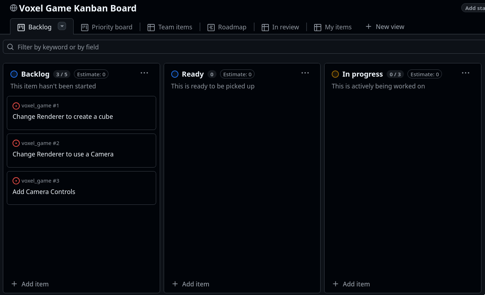

# voxel_game

voxel_game is an implementation of a Minecraft style voxel game engine in C++ using OpenGL.

## Purpose

voxel_game was built as a class final assignment for CS 4450 - Computer Graphics. The goal of the assignment was to create a voxel rendering engine complete with chunking and several block types. In addition to this, it was decided that voxel_core would implement basic block interactions, movement physics, and a menu system.

## Development Timeline

The primary timeline of voxel_game was split up into three stages of development with increasing target complexity.

**Stage 1:** Creation of OpenGL context and window, Basic app-state management and cube rendering.
**Stage 2:** Basics of chunk system, texture mapped cubes, and basic terrain generation.
**Stage 3:** Advanced terrain generation, live chunk streaming, physical interactions.

The tasks to be completed in each stage were split up into atomic units, and organized using a kanban board.

 

## Building

To build voxel_game simply clone the project into a vacant directory and run...

```
mkdir build
cd build
cmake ..
cmake --build .
```

The executable will be present at build/src/core/voxel_core

### Dependencies

This project relies on submodules for a majority of its dependencies, so make sure to run

`git submodule update --init`

Before attempting to build if your git solution does not automatically clone submodules.

## Contributors

[Aidan Bush](www.github.com/Its-Cryptic): Programming
[Ben Anderson](www.github.com/Astotheles): Programming
[Luke Lewis](www.github.com/L-P-Lewis): Programming, System Designer
